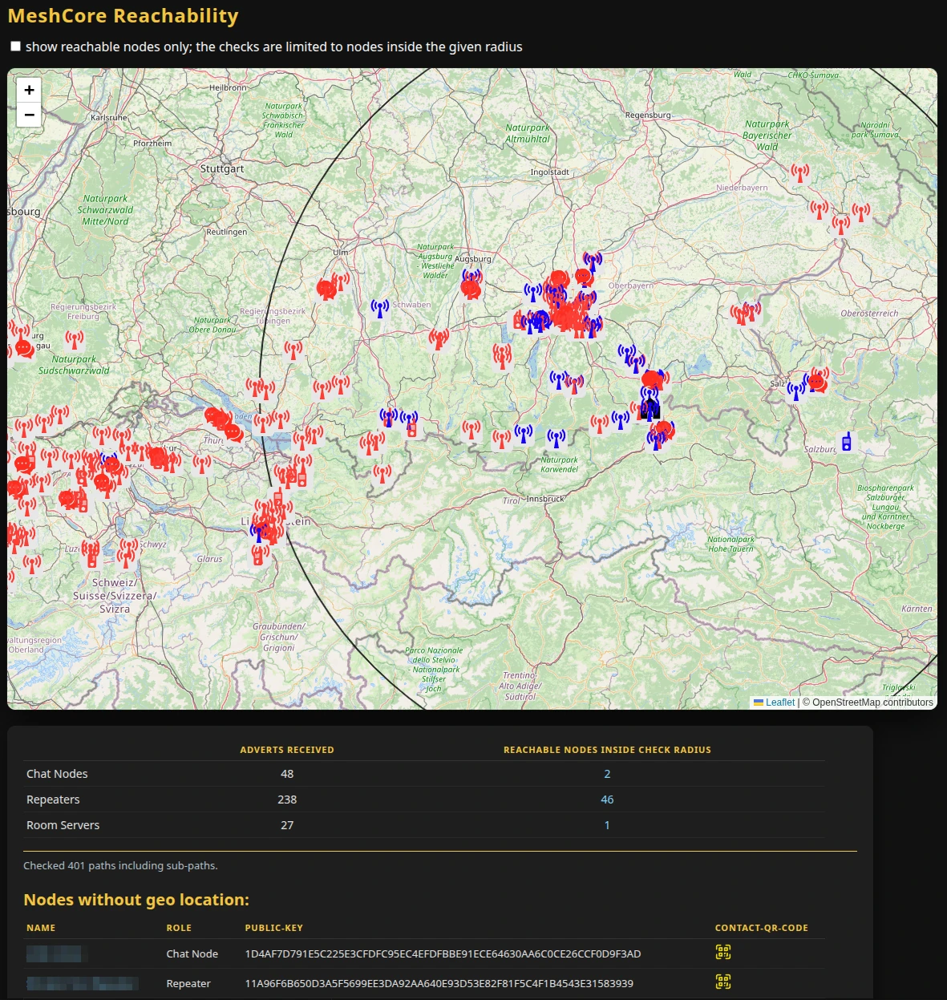

# MeshCore Reachability

MeshCore Reachability is a helper/diagnostic tool for MeshCore LoRa nodes. It listens to MeshCore RF log data, collects adverts from nearby nodes, automatically checks the RF reachability of discovered paths (including Chat Nodes, Repeaters and Room Servers) and stores all results in an SQLite database. Optionally, it starts a Dash + Leaflet web UI to visualize nodes on a map, show which of them are actually reachable, and display basic statistics.



---

## Features

- Listens on a MeshCore serial port and decodes received RF packets.
- Collects adverts and stores node metadata (public key, name, role, location, last path, last modification) in SQLite.
- Analyses advert paths and executes on-air trace tests per path prefix.
- Records per-hop SNR values for successful traces and keeps history.
- Optionally sends reverse messages to Chat Nodes and waits for ACKs to confirm end-to-end reachability.
- Cleans up old MeshCore repeater contacts automatically.
- Provides a Dash + Leaflet based web UI that
  - shows nodes on a map (OpenStreetMap or MapTiler background),
  - highlights nodes with at least one successful trace,
  - limits checks to nodes within a configurable radius of a home location,
  - displays statistics by node type (Chat Node / Repeater / Room Server),
  - lists nodes without geo location and provides QR codes for easy contact import.

---

## Requirements

- Python 3.10+
- A working MeshCore environment with serial access to a LoRa device
- SQLite (Python `sqlite3` module is used, no external server required)

Python dependencies (installable via `pip`):

- `meshcore` (and its dependencies)
- `meshcoredecoder`
- `dash`
- `dash-leaflet`
- `qrcode`

You may also need any libraries required by those packages (see their respective documentation).

---

## Installation

Clone this repository and install the Python dependencies into your environment (virtualenv recommended):

```bash
git clone https://github.com/usrflo/MeshCore-Reachability.git
cd MeshCore-Reachability

# Example: use a virtual environment
python3 -m venv .venv
source .venv/bin/activate  # Windows: .venv\\Scripts\\activate

pip install -r requirements.txt
# or install needed libraries manually, e.g.:
# pip install meshcore meshcoredecoder dash dash-leaflet qrcode
```

Make sure your user has permission to access the serial port used by the LoRa device (e.g. is in the `dialout` group on Linux).

---

## Usage

The main script is `meshcore_reachability.py`. It is designed to be run as a standalone tool and can operate in three modes:

- **Collector + Web UI (default)** – collects adverts, writes to SQLite, and serves the Dash web UI.
- **Headless collector** – collects data without starting the web UI.
- **GUI only** – runs the web UI on top of an existing/matching SQLite database without collecting new data.

### Basic command line

```bash
python3 meshcore_reachability.py \
  --port /dev/ttyUSB0 \
  --latitude 47.73322 \
  --longitude 12.11043
```

This will:

- connect to the MeshCore device on `/dev/ttyUSB0` at 115200 baud,
- create or open `mcreach.sqlite` in the current directory,
- use the given coordinates as the home location,
- limit reachability checks to nodes within the default radius of 200 km,
- start the Dash web UI at `http://0.0.0.0:5342`.

Stop the tool with `Ctrl+C`.

### Command line options

From `--help` in `meshcore_reachability.py`:

```text
usage: meshcore_reachability.py [-h] -p PORT [--db DB] -lat LATITUDE -lon LONGITUDE
                                [-rad CHECKRADIUS_KM] [--headless] [--guionly]
                                [-ak MAPTILER_API_KEY]

MeshCore Reachability Graph

options:
  -h, --help            show this help message and exit
  -p PORT, --port PORT  LoRa-Device serial port
  --db DB               SQLite database file (default: mcreach.sqlite)
  -lat LATITUDE, --latitude LATITUDE
                        Latitude of home location, e.g. 47.73322
  -lon LONGITUDE, --longitude LONGITUDE
                        Longitude of home location, e.g. 12.11043
  -rad CHECKRADIUS_KM, --checkradius_km CHECKRADIUS_KM
                        limit path checks on nodes within this radius from the
                        home location (in km) to reduce traffic (default: 200.0)
  --headless            Run packet collection without web-ui
  --guionly             Run web-ui without packet collection
  -ak MAPTILER_API_KEY, --maptiler_api_key MAPTILER_API_KEY
                        Optional MapTiler API key for background map
```

#### Required parameters

- `-p, --port` – Serial port of the MeshCore LoRa device (e.g. `/dev/ttyUSB0`, `COM4`).
- `-lat, --latitude` – Latitude of the monitoring station (home location).
- `-lon, --longitude` – Longitude of the monitoring station (home location).

#### Optional parameters

- `--db` – Path to the SQLite database file. If not existing, it will be created and the required schema initialized.
- `-rad, --checkradius_km` – Maximum distance (in km) from home location within which nodes are actively tested. Nodes outside the radius still have adverts stored but are not used for additional trace checks.
- `--headless` – Only run the collector; do not start Dash. Useful if the data will be visualized from another machine or later.
- `--guionly` – Only run the Dash UI using an existing database. No new packets will be collected.
- `-ak, --maptiler_api_key` – If provided, the UI will use MapTiler topo tiles instead of OpenStreetMap. You must obtain an API key from [MapTiler](https://www.maptiler.com/).

> Note: `--headless` and `--guionly` are mutually exclusive. Do not enable both at the same time.

---

## Database

MeshCore Reachability maintains a single SQLite file (default: `mcreach.sqlite`) with the following main objects:

- `nodes` – one row per advertising node, including name, public key, role, coordinates, last path and last modification.
- `paths` – unique path strings (comma-separated node key prefixes) and basic metadata (target node, usage counter, last modification).
- `traces` – results of trace runs for known paths; SNR lists or `NULL` when a trace failed.
- `pathtraces` – a convenience view joining `paths` and `traces` and resolving node names.

You can inspect the database directly with standard SQLite tools if needed.

---

## License

This project is licensed under the MIT License.

```text
MIT License

Copyright (c) 2025 Florian Sager

Permission is hereby granted, free of charge, to any person obtaining a copy
of this software and associated documentation files (the "Software"), to deal
in the Software without restriction, including without limitation the rights
to use, copy, modify, merge, publish, distribute, sublicense, and/or sell
copies of the Software, and to permit persons to whom the Software is
furnished to do so, subject to the following conditions:

The above copyright notice and this permission notice shall be included in all
copies or substantial portions of the Software.

THE SOFTWARE IS PROVIDED "AS IS", WITHOUT WARRANTY OF ANY KIND, EXPRESS OR
IMPLIED, INCLUDING BUT NOT LIMITED TO THE WARRANTIES OF MERCHANTABILITY,
FITNESS FOR A PARTICULAR PURPOSE AND NONINFRINGEMENT. IN NO EVENT SHALL THE
AUTHORS OR COPYRIGHT HOLDERS BE LIABLE FOR ANY CLAIM, DAMAGES OR OTHER
LIABILITY, WHETHER IN AN ACTION OF CONTRACT, TORT OR OTHERWISE, ARISING FROM,
OUT OF OR IN CONNECTION WITH THE SOFTWARE OR THE USE OR OTHER DEALINGS IN THE
SOFTWARE.
```
